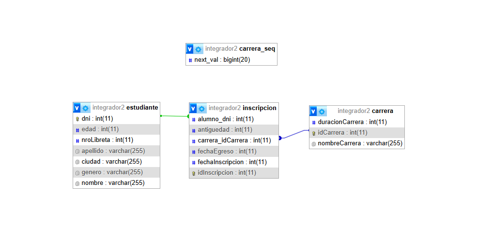
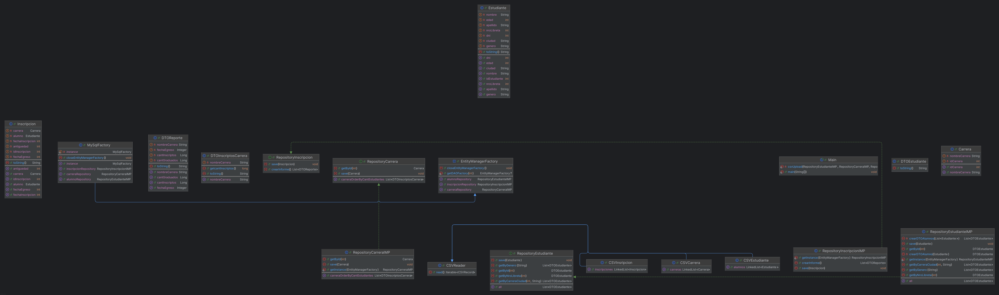

# Trabajo Práctico Especial :computer:


## Primera entrega:

- [x] Proyecto Java orientado a la persistencia de datos usando **JDBC** y **DAO pattern**.
- [x] Gestión de entidades (Productos, Compras, etc.) conectadas a una base de datos **MySQL**.

---

### Tabla de Contenidos
- [Descripción](#descripción)
- [Arquitectura](#arquitectura)
- [Requisitos](#requisitos)
- [Instalación](#instalación)
- [Uso](#uso)
- [Estructura del Proyecto](#estructura-del-proyecto)
- [Autores](#autores)

---

### Descripción
Este proyecto corresponde al **Trabajo Práctico Especial** de la materia.  
Se centra en la implementación de un **sistema CRUD** para la gestión de productos y compras usando **Java, JDBC y MySQL**.  

El objetivo es aprender a:
- Conectarse a una base de datos.  
- Manipular entidades con **DAO (Data Access Object)**.  
- Ejecutar operaciones **CRUD (Create, Read, Update, Delete)**.  

---

### Arquitectura
- **Lenguaje:** Java 22  
- **Persistencia:** JDBC con MySQL | Derby | Postgres  
- **Gestión de dependencias:** Maven  
- **Patrón usado:** DAO  

---

### Requisitos
Antes de instalar el proyecto, asegurate de tener:  
- [Java JDK 22+]
- [Apache Maven](https://maven.apache.org/)  
- [MySQL 8]
- Docker (opcional, si querés levantar la DB en contenedor)  

---

### Instalación

1. Clonar el repositorio:
```bash
git clone https://github.com/MatiasBavacc/TrabajoPracticoEspecial.git
cd TrabajoPracticoEspecial
```

2. Crear la base de datos (ejemplo):
```sql
CREATE DATABASE integrador1;
```

### Uso

### Estructura del Proyecto
```
src/
 └── main/java/dao         # Clases DAO (ProductoDao, CompraDao, etc.)
 └── main/java/entities    # Entidades del sistema (Producto, Compra)
 └── main/java/factory     # Conexion con la db
 └── main/java/main        # Pruebas de funcionamiento
 └── main/java/utils       # Utilidades para llenar la db
 └── main/resources        # Archivos de configuración (scv)
```

---


## Segunda entrega:

- Proyecto Java orientado a la persistencia de datos usando JPA y DAO pattern.
- Gestión de entidades (Estudiantes, Carreras, Inscripciones) conectadas a una base de datos MySQL.
- Lectura de datos desde archivos CSV.
- Generación de reportes y consultas avanzadas.
- Tabla de Contenidos
### Descripción
- Arquitectura
- Requisitos
- Instalación
- Uso
### Estructura del Proyecto
- Descripción Esta segunda entrega amplía el sistema, incorporando la gestión de Estudiantes, Carreras e Inscripciones. Se utiliza JPA para la persistencia y se agregan funcionalidades para importar datos desde archivos CSV y generar reportes.
- Arquitectura
- Lenguaje: Java 22
- Persistencia: JPA con MySQL
- Gestión de dependencias: Maven
- Patrón usado: DAO
- Lectura de datos: CSV
- Requisitos Antes de instalar el proyecto, asegurate de tener:
- Java JDK 22+
- Apache Maven
- MySQL 8
- Docker (opcional, si querés levantar la DB en contenedor)
- Instalación
- Clonar el repositorio: git clone https://github.com/MatiasBavacc/TrabajoPracticoEspecial.git cd TrabajoPracticoEspecial/Entrega2
- Crear la base de datos (ejemplo): CREATE DATABASE integrador2;
- Configurar el archivo src/main/resources/META-INF/persistence.xml con tus credenciales de MySQL.
### Uso
- Ejecutar la aplicación desde la clase src/main/java/main/Main.java.
- Los archivos CSV deben estar en src/main/resources/csv/.
- Los reportes se generan en consola o en archivos según la configuración.
### Estructura del Proyecto
- src/ main/java/dto Clases DTO para reportes y transferencias 
- main/java/entities Entidades del sistema (Estudiante, Carrera, Inscripcion) 
- main/java/factory Factories para EntityManager 
- main/java/main Clase principal 
- main/java/repository Repositorios JPA 
- main/java/utils Utilidades para leer CSV 
- main/resources/csv Archivos CSV de datos 
- main/resources/META-INF Configuración de JPA
### DER


### DIAGRAMA DE OBJETOS



## Tercera entrega:

### Tecnologías Utilizadas

- **Java 22**
- **Spring Boot 3.3.0**
    - Spring Data JPA
    - Spring Web
    - Spring Boot DevTools
- **Hibernate 6.5.2** (con MySQL Dialect)
- **MySQL 8.0+**
- **Maven** - Gestión de dependencias
- **Lombok** - Reducción de código boilerplate
- **Apache Commons CSV 1.8** - Procesamiento de archivos CSV
- **Arquitectura REST** - API RESTful con ResponseEntity

### API Endpoints

#### Estudiante

| Método | Endpoint | Descripción | Parámetros |
|--------|----------|-------------|------------|
| **GET** | `/estudiante/` | Obtener todos los estudiantes | - |
| **GET** | `/estudiante/{id}` | Obtener estudiante por DNI | `id`: DNI del estudiante |
| **GET** | `/estudiante/ordenar` | Obtener estudiantes ordenados | `criterio`: nombre, apellido, edad, dni, ciudad, etc. |
| **GET** | `/estudiante/nroLibreta/{nroLibreta}` | Buscar por número de libreta | `nroLibreta`: número único |
| **GET** | `/estudiante/genero/{genero}` | Filtrar por género | `genero`: Masculino/Femenino |
| **GET** | `/estudiante/filtro` | Filtrar por carrera y ciudad | `carrera`, `ciudad` |
| **POST** | `/estudiante/` | Crear nuevo estudiante | JSON body |

#### Carrera

| Método | Endpoint              | Descripción |
|--------|-----------------------|-------------|
| **GET** | `/carrera/`           | Obtener todas las carreras |
| **GET** | `/carrera/inscriptos` | Carreras ordenadas por cantidad de inscriptos |

#### Inscripcion

| Método | Endpoint                         | Descripción | Parámetros |
|--------|----------------------------------|-------------|------------|
| **POST** | `/inscripcion/matricular`        | Matricular estudiante en carrera | `estudianteId`, `carreraId` |
| **GET** | `/inscripcion/reportes` | Reporte de carreras con inscriptos/egresados por año | - |

#### Codigos de estado HTTP

- **200 OK**: Solicitud exitosa
- **201 CREATED**: Recurso creado exitosamente
- **204 NO CONTENT**: Solicitud exitosa pero sin contenido para devolver
- **404 NOT FOUND**: Recurso no encontrado
- **500 INTERNAL SERVER ERROR**: Error del servidor

#### Comprobacion en Postman
- Importar la colección Postman desde `Entrega3/src/resources/request/`.
- La url por defecto es `http://localhost:8080/`.
- [!Postman Collection Estudiante](Entrega3/src/resources/request/Entrega3.Estudiante.postman_collection.json)
- [!Postman Collection Carrera](Entrega3/src/resources/request/Entrega3-Carrera.postman_collection.json)
- [!Postman Collection Inscripcion](Entrega3/src/resources/request/Entrega3-Inscripcion.postman_collection.json)


## Autores

| Nombre    | Apellido | DNI         | E-mail                        | Sede   |
|-----------|----------|-------------|-------------------------------|--------|
| Matías    | Bava     | 38.961.362  | matiasbavacc@gmail.com        | Tandil |
| Alejandro | Garay    | 18.038.228  | alejandrogaray1966@gmail.com  | Tandil |
| Agustin   | Rypstra  | 42.117.730  | agusrypstra@gmail.com         | Tandil |
| Valentin  | Navarro  | ********    | *********************         | Tandil |
